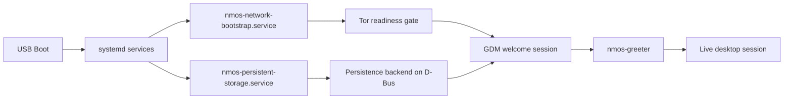

# NM-OS

## Overview

NM-OS is being built as a USB-booted live operating system with a privacy-first
default posture. The current alpha platform focuses on a clean boot flow, a
real pre-login welcome session, Tor-gated networking, and LUKS2-backed
persistence that fails closed on unsupported layouts.

## Quick Links

- [Windows + WSL2 workflow](docs/windows-wsl.md)
- [Build notes](docs/build.md)
- [Runtime notes](docs/runtime.md)
- [USB boot checklist](docs/usb-boot-checklist.md)

## Alpha Focus

| Area | Current direction |
| --- | --- |
| Base system | Debian Trixie `amd64` live image |
| Desktop flow | GNOME + GDM welcome session before the live desktop |
| Network model | Tor-first bootstrap with an outbound gate until readiness |
| Persistence | LUKS2-backed encrypted persistence on the boot USB |
| Developer workflow | Windows editor + WSL2 build + Rufus USB write |

## Design Goals

- Keep the live runtime small, inspectable, and easy to reason about.
- Default to a safe network posture instead of optimistic connectivity.
- Make persistence explicit, encrypted, and tied to the boot USB.
- Support practical development from Windows without turning the image into a Windows-native build target.

## Boot Flow



## What Ships In The Current Alpha

- Pre-login `nmos-greeter` for language, keyboard, network state, and persistence actions
- System-bus persistence backend exposed as `org.nmos.PersistentStorage`
- Tor bootstrap gate that blocks ordinary outbound traffic until readiness
- Optional Brave Browser build hook for users who want a non-Tor privacy browser in the image
- Repo hygiene and smoke checks for build/runtime wiring

Brave support is optional and privacy-focused, but it is not a substitute for
Tor Browser anonymity guarantees.

## Quick Start

### Windows + WSL2

```powershell
.\build\install-deps.ps1
.\build\build.ps1
```

Optional Brave build:

```powershell
.\build\build.ps1 -EnableBrave
```

### Linux / WSL2 Direct

```bash
./build/build.sh
```

Optional Brave build:

```bash
NMOS_ENABLE_BRAVE=1 ./build/build.sh
```

## Build Artifacts

The build publishes:

- `dist/nmos-amd64-<version>.img`
- `dist/nmos-amd64-<version>.iso`
- `dist/nmos-amd64-<version>.sha256`
- `dist/nmos-amd64-<version>.packages`
- `dist/nmos-amd64-<version>.build-manifest`

For Windows USB testing, the primary artifact is the `.img` file.

## Repository Layout

- `apps/` first-party greeter and backend services
- `build/` build entry points, wrappers, and verification scripts
- `config/` live-build project files and runtime image content
- `docs/` operator notes, build workflow, and boot guidance
- `hooks/` live-build hooks for runtime assembly
- `tests/` smoke checks for repo hygiene, runtime wiring, and alpha safety rules

## Status And Limits

This repository already contains the alpha platform scaffold and a working
structure for:

- image assembly
- pre-login GDM welcome flow
- Tor-gated readiness tracking
- persistence management
- Windows-oriented build wrappers

Still intentionally out of scope for the current alpha:

- internal-disk installer
- updater
- full amnesic guarantees
- broad application bundle
- release-grade hardware validation

## Smoke Checks

Before a build:

```bash
./tests/smoke/verify-structure.sh
./tests/smoke/verify-python.sh
./tests/smoke/verify-build-hygiene.sh
./tests/smoke/verify-brave-optional.sh
./tests/smoke/verify-greeter-state.sh
./tests/smoke/verify-live-login-config.sh
./tests/smoke/verify-network-gate-transition.sh
./tests/smoke/verify-network-status-normalization.sh
./tests/smoke/verify-prelogin-wiring.sh
./tests/smoke/verify-persistence-state-machine.sh
./tests/smoke/verify-runtime-logic.sh
./tests/smoke/verify-disk-safety.sh
./tests/smoke/verify-leaks.sh
```

After a build:

```bash
./tests/smoke/verify-artifacts.sh
./build/smoke-qemu.sh
```

## License

NM-OS is licensed under `GPL-3.0-or-later`. See [LICENSE](LICENSE) and
[COPYING](COPYING).
