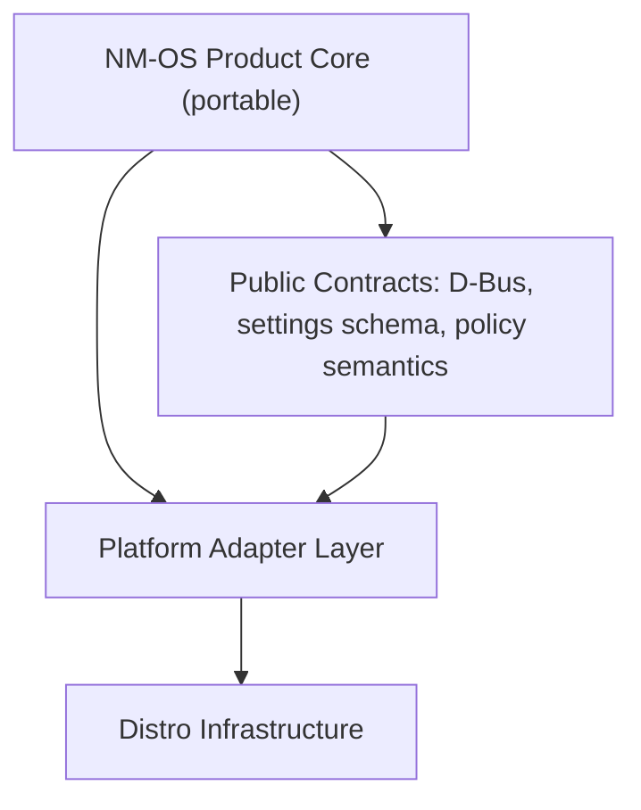

# 02 Modular Architecture

## Purpose
Define architectural boundaries that let NM-OS product logic stay portable while distro infrastructure evolves.

## Current State
Current codebase already shows separable layers, but assembly is overlay-driven and some platform assumptions are mixed into runtime helpers.

## Evidence From Repo
- Product and shared logic:
  - `apps/nmos_common/nmos_common/*`
  - `apps/nmos_settings/nmos_settings/service.py`
  - `apps/nmos_greeter/nmos_greeter/*`
  - `apps/nmos_control_center/nmos_control_center/main.py`
  - `apps/nmos_persistent_storage/nmos_persistent_storage/*`
- Platform integration:
  - `config/system-overlay/usr/local/lib/nmos/*`
  - `config/system-overlay/usr/lib/systemd/system/*`
  - `config/system-overlay/etc/dbus-1/system.d/*`
- Build-time assembly:
  - `build/lib/common.sh`
  - `build/build.sh`

## Recommended Layer Model
1. Portable NM-OS Product Core
2. Platform Adapter Layer
3. Distro Infrastructure Layer

## Layer 1: Portable Product Core
Includes:
- settings schema and profile semantics (`apps/nmos_common/nmos_common/system_settings.py`)
- runtime state safety helpers (`apps/nmos_common/nmos_common/runtime_state.py`)
- user-facing applications:
  - greeter
  - control center
  - settings service contract
  - persistent storage business logic interfaces

Contract to preserve:
- `org.nmos.Settings1`
- `org.nmos.PersistentStorage`
- settings keys and semantic behavior (`network_policy`, `pending_reboot`, vault policy fields)

## Layer 2: Platform Adapter Layer
Includes:
- command and identity adapters for distro-specific tools/usernames
- policy application helpers currently under:
  - `config/system-overlay/usr/local/lib/nmos/network_bootstrap.py`
  - `config/system-overlay/usr/local/lib/nmos/desktop_mode.py`
  - `config/system-overlay/usr/local/lib/nmos/brave_policy.py`
  - `config/system-overlay/usr/local/lib/nmos/settings_bootstrap.py`
- launchers and service wrappers under `config/system-overlay/usr/local/bin`

Target:
- move distro assumptions from product code into adapter module(s):
  - user/group identity lookup
  - package/tool command discovery
  - filesystem layout capability checks

## Layer 3: Distro Infrastructure
Includes:
- package repository metadata and signing
- image generation pipeline
- installer implementation
- boot artifacts and release channels
- CI/release orchestration for distro outputs

Current location:
- `build/`
- `config/installer/`
- package manifests under `config/*-packages/`

## Module Analysis and Future Boundaries

### nmos_common
- Current: shared schema/helpers, D-Bus client, runtime state safety.
- Future boundary: keep pure and dependency-light; no distro tool invocations.

### nmos_settings
- Current: D-Bus service wrapper over system settings functions.
- Future boundary: service interface package; adapter should provide persistence backend hooks if needed.

### nmos_greeter
- Current: setup assistant with persistence and network state surfaces.
- Future boundary: UI/business flow package, no installer-engine coupling.

### nmos_control_center
- Current: desktop settings UX.
- Future boundary: settings UI package, adapter-backed capability checks.

### nmos_persistent_storage
- Current: vault orchestration via command execution.
- Future boundary: abstract crypto/mount command provider by platform adapter.

### system-overlay runtime helpers
- Current: mixed policy/runtime scripts.
- Future boundary: dedicated adapter package (`nmos-platform-adapter`) plus policy units.

## Gaps
- Build process treats app directories as copied payload, not package dependencies.
- No explicit adapter interface contract file yet.
- Runtime helper scripts still include platform assumptions directly.

## Recommended Direction
1. Create adapter interface docs and module skeleton.
2. Keep public D-Bus/schema stable while migrating infrastructure.
3. Convert service/runtime scripts into package-owned units with adapter dependencies.

## Alternatives Considered
1. Keep mixed architecture:
   - faster short term, hard to port.
2. Big-bang module split now:
   - high disruption risk.
3. Incremental boundary enforcement:
   - recommended.

## Migration Steps
1. Define adapter contract (`identity`, `tooling`, `filesystem`, `network backend` capability).
2. Move direct distro assumptions out of product packages.
3. Add CI check ensuring product core imports do not depend on distro-only modules.

## Risks
- Over-abstracting too early can slow feature work.
- Under-abstracting keeps migration debt hidden.

## Exit Criteria
- Product packages are installable with adapter stubs in tests.
- Distro migration tasks touch adapter/infrastructure layer only for most changes.

## Fact / Inference / Assumption
- FACT: first-party apps are already in separate directories under `apps/`.
- FACT: system overlay helpers apply platform policies post-boot.
- INFERENCE: current boundaries are workable but not explicitly enforced.
- ASSUMPTION: team accepts preserving D-Bus/settings contracts as compatibility anchor.

