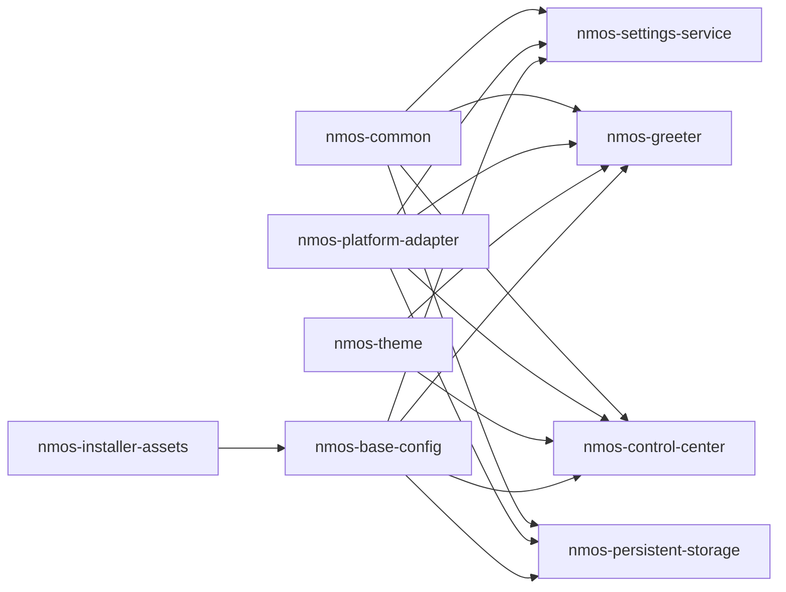

# 03 Packaging Strategy

## Purpose
Move NM-OS from overlay-copy assembly toward package-first composition without breaking current alpha output.

## Current State
- `build/lib/common.sh` stages runtime by copying `config/system-overlay` plus Python package directories from `apps/*`.
- `build/build.sh` exports `nmos-system-overlay-<version>.tar.gz` and `.packages`.
- Package manifests are text lists:
  - `config/system-packages/base.txt`
  - `config/installer-packages/base.txt`

## Evidence From Repo
- `build/lib/common.sh` (`stage_system_overlay_tree`, `install_python_package_dir`)
- `build/build.sh` (manifest and package list artifact output)
- `tests/python/test_runtime_logic.py` (asserts current staging behavior)

## Target State
Package-driven assembly where image generation installs NM-OS component packages from NM-OS repositories/channels.

## Recommended Package Split
- `nmos-common`
  - settings schema, runtime-state safety, config helpers
- `nmos-settings-service`
  - `org.nmos.Settings1` service + unit + D-Bus policy
- `nmos-greeter`
  - setup assistant app and session desktop entries
- `nmos-control-center`
  - desktop control center app
- `nmos-persistent-storage`
  - vault service, D-Bus policy, backend operations
- `nmos-theme`
  - CSS, wallpapers, branding-shared assets
- `nmos-base-config`
  - tmpfiles, default config, autostart entries, platform defaults
- `nmos-installer-assets`
  - installer UI assets/templates and installer-side scripts
- `nmos-platform-adapter` (new)
  - distro-specific identity/tool/path adapters

## Dependency Graph (initial)

## Migration Model
Phase 1:
- Keep current overlay build output.
- Add package metadata scaffolding for each component.
- Build packages in CI as non-release artifacts.

Phase 2:
- Change image assembly to install NM-OS packages into rootfs staging.
- Keep overlay artifact only as compatibility fallback.

Phase 3:
- Remove overlay as primary release artifact.
- Preserve emergency overlay generation only for recovery tooling if needed.

## How Current Build Evolves
- Today:
  - copy tree and tar it (`build/lib/common.sh` and `build/build.sh`)
- Future:
  - resolve package set from image definition
  - install package set into rootfs
  - image manifest records exact package versions/digests

## Alternatives Considered
1. Continue overlay-first indefinitely:
   - simple, but weak lifecycle control.
2. Immediate full package conversion:
   - high risk and likely build breakage.
3. Dual-path migration:
   - recommended.

## Risks
- Packaging metadata drift from runtime expectations.
- Unit/service file ownership confusion during transition.

## Open Questions
- Native package format strategy for first independent release.
- Build backend choice for Python component packaging.

## Exit Criteria
- Every first-party component above has a package definition and CI build.
- Image pipeline can assemble from package definitions without copying `apps/*` directly.

## Fact / Inference / Assumption
- FACT: current assembly installs app dirs via `install_python_package_dir`.
- FACT: package list outputs are plain text manifests.
- INFERENCE: component boundaries are already close to package boundaries.
- ASSUMPTION: first independent cycle still targets systemd + GNOME + GDM.

