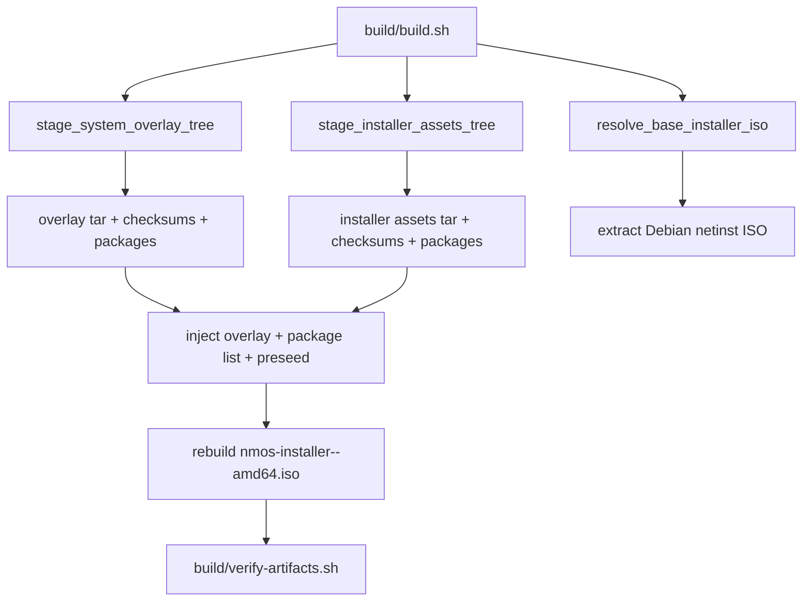

# 04 Image Build Architecture

## Purpose
Document current build flow precisely and define the future image/rootfs pipeline for independent NM-OS releases.

## Current State
Current build flow:
1. Validate host/tools/version.
2. Stage runtime overlay tree (`config/system-overlay` + `apps/*`).
3. Stage installer assets (`config/installer` + `config/installer-packages`).
4. Produce overlay and installer tar artifacts.
5. Resolve Debian netinst ISO and checksums.
6. Inject NM-OS preseed and payload into extracted ISO tree.
7. Rebuild installer ISO and verify artifacts.

## Evidence From Repo
- `build/build.sh`
- `build/lib/common.sh`
- `build/verify-artifacts.sh`
- `tests/smoke/verify-installer-media.sh`
- `docs/build.md`

## Current Flow Diagram

## Target State
Image builder with explicit image definitions and package-driven rootfs assembly.

Target image families:
- base image
- desktop image
- installer image
- recovery image

## Reuse vs Replace
Reuse:
- version policy (`config/version`, `validate_version_format`)
- artifact verification patterns
- smoke gate structure (`.github/workflows/smoke.yml`)
- first-party runtime components

Replace:
- Debian netinst dependency and ISO tree patching
- preseed-driven overlay extraction path
- copy-first staging as primary assembly model

## Proposed Future Pipeline
1. Resolve image definition manifest.
2. Resolve package graph and pinned versions.
3. Build rootfs from NM-OS package repositories and mirrored base repositories.
4. Apply image profile overlays (minimal, desktop, installer, recovery).
5. Generate boot assets from image definition.
6. Emit signed image metadata and checksums.

## Suggested Low-Risk Scaffolding
Add future definitions under `docs/independence/templates/`:
- image definition template
- package-set template
- release manifest template

## Migration Steps
1. Introduce non-production image-definition parser in CI lint stage.
2. Build rootfs prototype artifact in parallel to current output.
3. Add boot test for prototype image in nightly workflow.
4. Promote package-driven image to release candidate path.

## Risks
- Reproducibility challenges in early rootfs assembly.
- Boot regressions during transition from remixed ISO path.

## Open Questions
- Image build engine choice and reproducibility guarantees.
- Build cache strategy for local dev and CI.

## Exit Criteria
- NM-OS installer and desktop images are produced from image definitions, not patched Debian netinst media.

## Fact / Inference / Assumption
- FACT: current build requires `curl` and `xorriso` and remixes Debian netinst.
- FACT: artifact verification currently checks embedded preseed and overlay payload.
- INFERENCE: build verification scaffolding is strong enough to host future image gate checks.
- ASSUMPTION: rootfs builder can be introduced alongside current scripts before cutover.

